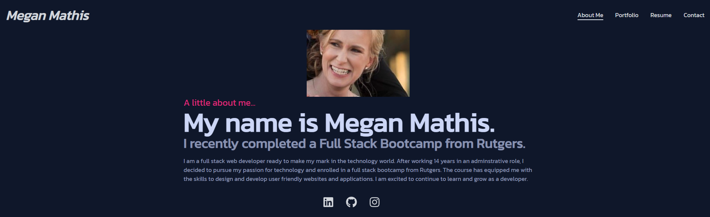
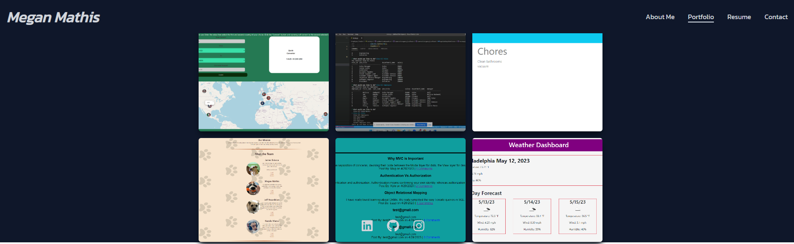
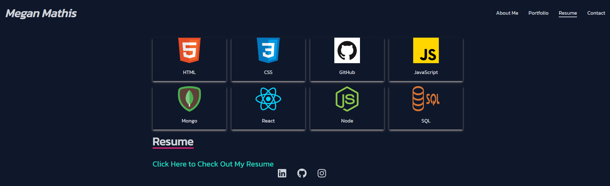
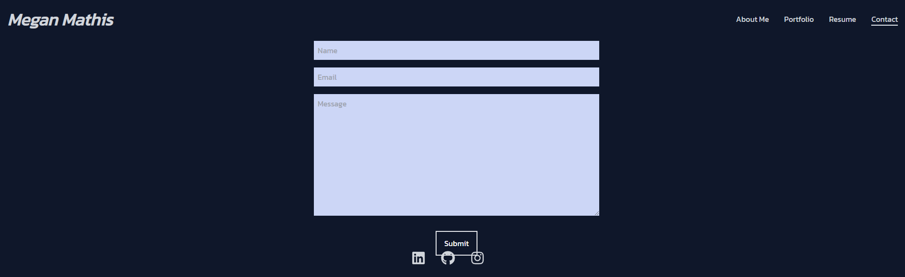

# Meg's React Portfolio

## Description

This application is my own personal portfolio.

The portfolio inclues a header, footer, and about me page, contact page, portfolio page (showing projects and homework), and a resume page(that shows my skill and a link to my resume).

## Table of Contents

- [Installation](#installation)
- [License](#license)
- [Usage](#usage)
- [ScreenShots](#screenshots)
- [Video](#video)
- [Links to Deployment](#linkstodeployment)
- [Credits](#LinkstoDeployment)
- [Contribution](#contribution)
- [Tests](#tests)
- [Questions](#questions)

## Installation

1. Vist page at :

## License

MIT

## Usage

1. Visit page at: https://megmathis.github.io/megan_mathis_react_portfolio/#

## ScreenShots

About Me

Portfolio

Resume

Contact

## Video

n/a

## Links to Deployment

Application:

https://megmathis.github.io/megan_mathis_react_portfolio/#

GitHub:

https://github.com/MegMathis/megan_mathis_react_portfolio

## Credits

https://coolors.co/

https://www.youtube.com/watch?v=x7mwVn2z3Sk

https://www.youtube.com/watch?v=0h2b4ftbZcU

https://create-react-app.dev/

https://www.freecodecamp.org/news/build-portfolio-website-react/

https://www.youtube.com/watch?v=bmpI252DmiI

https://www.youtube.com/watch?v=4oCVDkb_EIs

https://www.youtube.com/watch?v=2kg0z1qNrkw

https://www.npmjs.com/package/react-icons

https://fontawesome.com/v4/icon/bars

https://tailwindcss.com/docs/grid-row

https://app.getform.io/forms

https://reactrouter.com/en/main/start/tutorial

https://tailwindcolor.com/

https://redd.gitbook.io/react-advanced-form/components/field/callbacks/on-blur

https://www.c-sharpcorner.com/article/how-to-deploy-react-application-on-github-pages/

https://github.com/gitname/react-gh-pages

Ask BCS

20-React Activities

## Contribution

Megan Mathis

## Tests

n/a

## Questions

Any questions, please contact me at:

- GitHub:
  [MegMathis](http://github.com/MegMathis)
- Email:
  [mcdonough.megan25@gmail.com](mailto:mcdonough.megan25@gmail.com)
